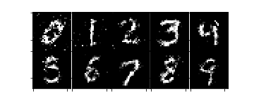
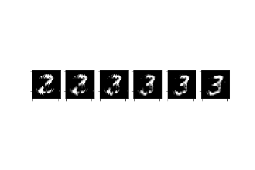
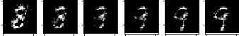
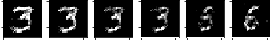

# tf-alae

(Unofficial) Tensorflow implementation of Adversarial Latent Autoencoder (ALAE, Pidhorskyi et al., 2020)

## Usage

To train the mnist model
```
python trainer.py
```

To open tensorboard summary
```
tensorboard --logdir summary
```

Jupyter notebook
- [mnist_expr.ipynb](./experiments/mnist_expr.ipynb): MLP-ALAE MNIST experiments.
- [mnist_stylealae.ipynb](./experiments/mnist_stylealae.ipynb): StyleALAE MNIST experiments.

## Structure

- [alae.py](./models/alae.py): Abstracted ALAE object.
- [mlpalae.py](./models/mlpalae.py): MLP-ALAE implementation.
- [stylealae.py](./models/stylealae/stylealae.py): StyleALAE implementation.
- [trainer.py](./utils/trainer.py): ALAE trainer.
- [mnist.py](./datasets/mnist.py): MNIST wrapper.

## Autoencoded



## Linear transform

- two - three



- eight - nine



- three - six

