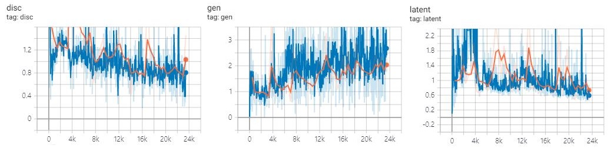
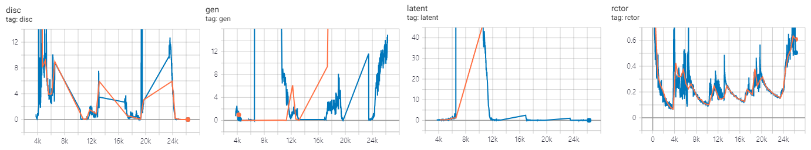
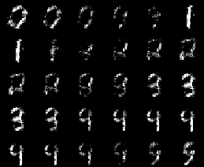
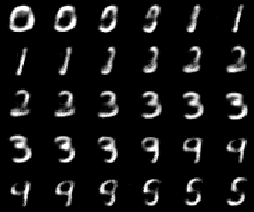

# tf-alae

(Unofficial) Tensorflow implementation of Adversarial Latent Autoencoder (ALAE, Pidhorskyi et al., 2020)

- Original paper, Adversarial Latent Autoencoder [[arXiv:2004.04467](https://arxiv.org/abs/2004.04467)]
- Full code is based on original repository [[GIT](https://github.com/podgorskiy/ALAE)].

## Usage

To train the mnist model
```bash
# to train mnist-alae
python mnist_mlp.py train

# to train style-alae
python mnist_style.py train
```

To open tensorboard summary
```
tensorboard --logdir summary
```

Currently, lsunbed-StyleALAE is experimental.

```bash
# to train lsunbed
python lsunbed_style.py train
```

To use released checkpoints, download files from [release](https://github.com/revsic/tf-alae/releases) and unzip it.

Following is example of [MNIST-MLP](https://github.com/revsic/tf-alae/releases/tag/MnistMlp).
```py
import json
from mnist_mlp import MnistAlae

with open('settings.json') as f:
    settings = json.load(f)

alae = MnistAlae(settings)
alae.load_weights('./mnist_mlp/mnist_mlp')
```

## Jupyter notebook

- [mnist_expr.ipynb](./experiments/mnist_expr.ipynb): MNIST interpolation with Mlp-ALAE
- [mnist_style.ipynb](./experiments/mnist_style.ipynb): MNIST interpolation with Style-ALAE

## Learning Curve

Mlp-ALAE + MNIST



Style-ALAE + MNIST



- In the original paper, they claim that latent reconstruction has better perceptual quality than image one so that they do not use image reconstruction loss in the original repository.
- But for more easy training, this repository use image reconstruction loss as pretraining at half of the epochs in each resolution level.

## Sample

MNIST-MLP 0 ~ 4 polymorph



MNIST-Style 0 ~ 4 polymorph


