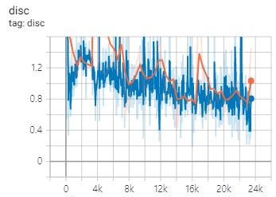
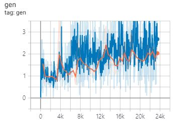
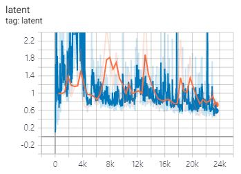

# tf-alae

(Unofficial) Tensorflow implementation of Adversarial Latent Autoencoder (ALAE, Pidhorskyi et al., 2020)

## Usage

To train the mnist model
```
python mnist_mlp.py train
```

To open tensorboard summary
```
tensorboard --logdir summary
```

Currently, StyleALAE is experimental.

```bash
# to train mnist
python mnist_style.py train

# to train lsunbed
python lsunbed_style.py train
```

## Jupyter notebook

- [mnist_expr.ipynb](./experiments/mnist_expr.ipynb): MNIST interpolation with Mlp-ALAE

## Learning Curve

Mlp-ALAE + MNIST





## Sample

two to three


three to six


eight to nine


